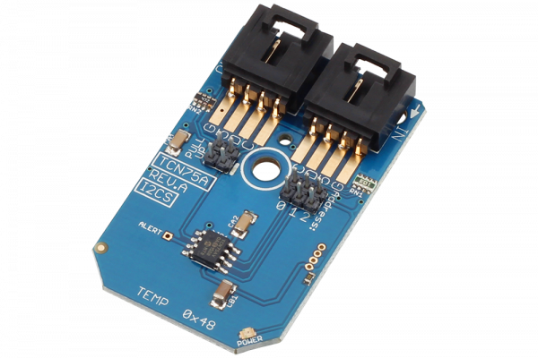

# TCN75A

The TCN75A comes with user-programmable registers that provide flexibility for temperature-sensing applications.The register settings allow user-selectable 0.5°C to 0.0625°C temperature measurement resolution. Configuration of the power-saving Shutdown and One-shot (single conversion on command while in Shutdown) modes.
This Device is available from www.ncd.io 

[SKU: TCN75A_I2CS]

(https://store.ncd.io/product/tcn75a-temperature-sensor-%C2%B10-5c-12-bit-with-3-address-lines-i2c-mini-module/)
This Sample code can be used with Arduino.

Hardware needed to interface TCN75A sensor with Arduino

1. <a href="https://store.ncd.io/product/i2c-shield-for-arduino-nano/">Arduino Nano</a>

2. <a href="https://store.ncd.io/product/i2c-shield-for-arduino-micro-with-i2c-expansion-port/">Arduino Micro</a>

3. <a href="https://store.ncd.io/product/i2c-shield-for-arduino-uno/">Arduino uno</a>

4. <a href="https://store.ncd.io/product/dual-i2c-shield-for-arduino-due-with-modular-communications-interface/">Arduino Due</a>

5. <a href="https://store.ncd.io/product/tcn75a-temperature-sensor-%C2%B10-5c-12-bit-with-3-address-lines-i2c-mini-module/">TCN75A Temperature Sensor</a>

6. <a href="https://store.ncd.io/product/i%C2%B2c-cable/">I2C Cable</a>

TCN75A:

The TCN75A comes with user-programmable registers that provide flexibility for temperature-sensing applications.The register settings allow user-selectable 0.5°C to 0.0625°C temperature measurement resolution. Configuration of the power-saving Shutdown and One-shot (single conversion on command while in Shutdown) modes.

Applications:

• Personal Computers and Servers

• Hard Disk Drives and Other PC Peripherals

• Entertainment Systems

• Office Equipment

• Data Communication Equipment

• General Purpose Temperature Monitoring

How to Use the TCN75A Arduino Library

The TCN75A has a number of settings, which can be configured based on user requirements.
          
1.Address calling:The following command is used to call the TCN75A sensor to begin the transmission.

          tcn.getAddr_TCN75A(TCN75A_DEFAULT_ADDRESS);           // 0x48, 1001 000
            
 2.One shot mode:The following command is used to Disable the one shot mode.
 
          tcn.setOneShot(ONESHOT_DISABLED);        // Disabled (Power-up default)
            
3.Shut down mode:The following command is used to Disable the shutdown mode.

          tcn.setShutdown(SHUTDOWN_DISABLE);      // Disable (Power-up default)
             
4.Resolution setting:THe following command is used to set the resolution.            
             
          tcn.setResolution(RESOLUTION_12);       // 12 bit, data shifted right by 4 bits, multiply by 0.0625, (___>> 4) * 0.0625
             
